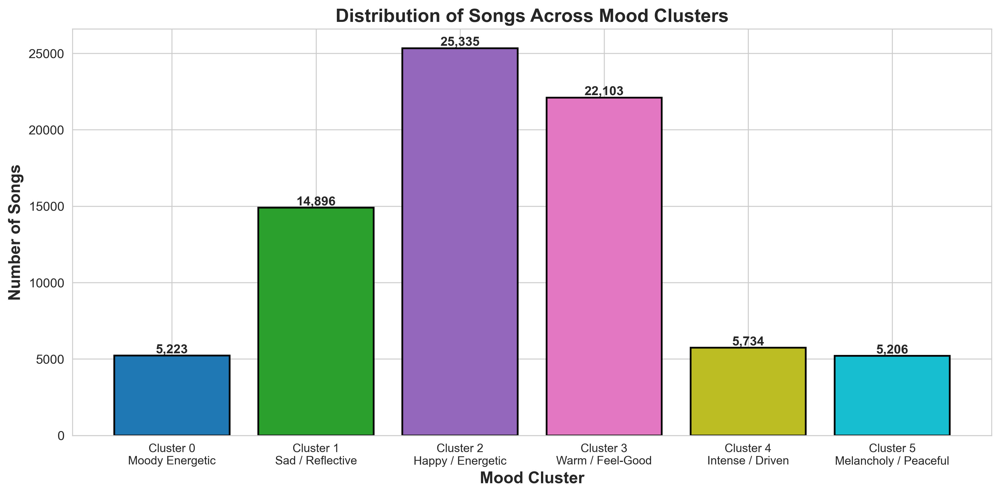
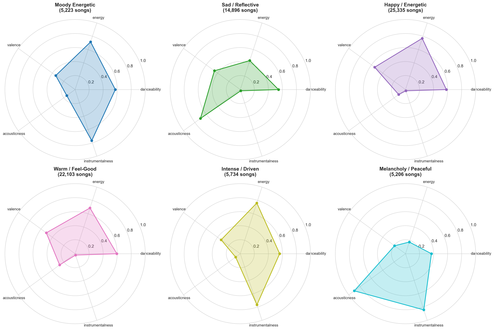
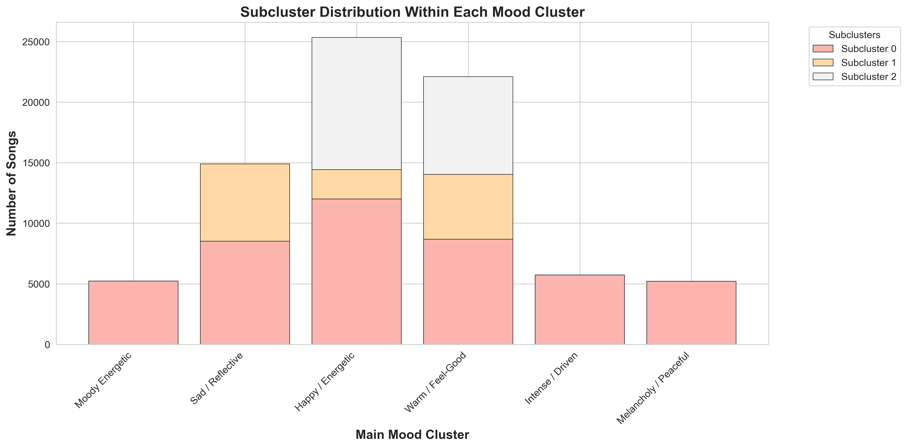
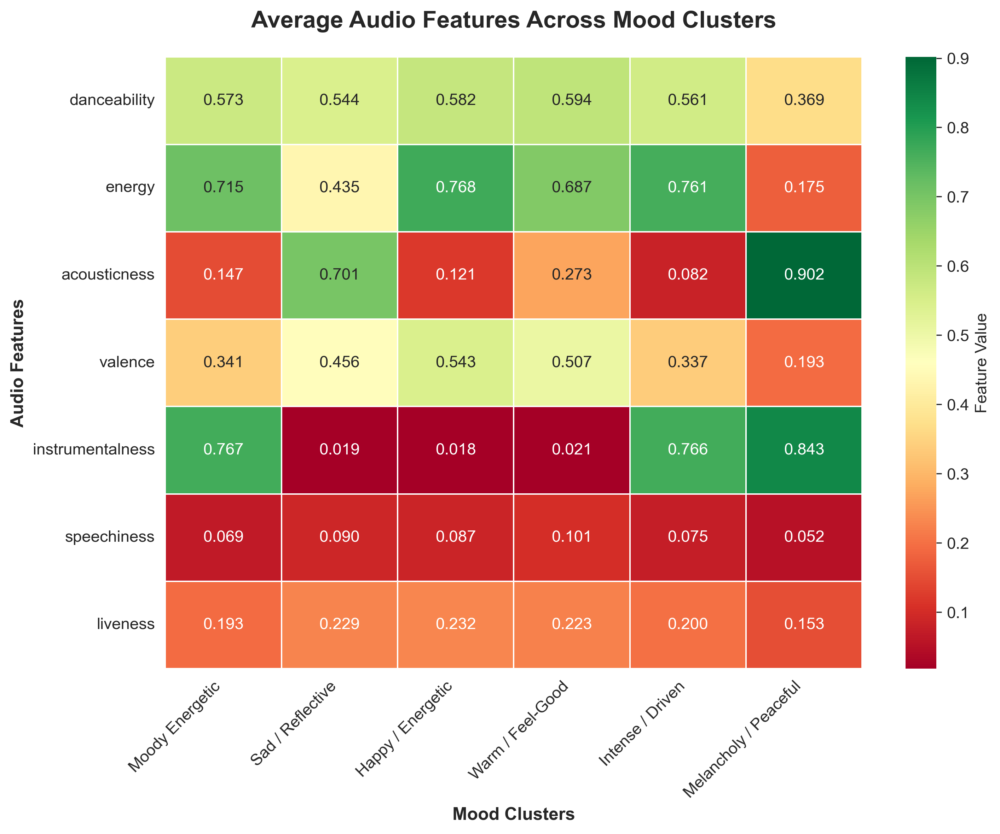
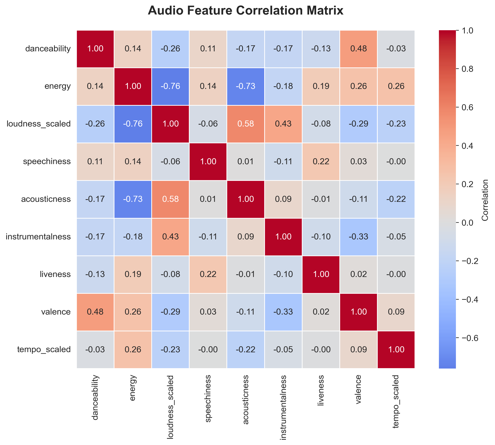

# Spotify Personalized Mood-Based Playlist Generation

This project showcases my skills in machine learning, specifically unsupervised learning through clustering techniques applied to music recommendation systems.

## Main Objective

The primary objective of this project is to develop a personalized music recommendation system that addresses the limitations of current streaming platforms. Traditional recommendation algorithms focus on artist similarity and popularity, ignoring the underlying musical characteristics (tempo, energy, acousticness) and the user's current emotional state. This project creates a mood-based clustering system that recommends songs based on audio feature similarity and emotional context, enabling users to discover new music that matches both their taste and their current mood.

## Project Steps

### Data Cleaning

1. **Data Inspection:** Conducted exploratory analysis of 114,000 Spotify tracks with 21 audio features including danceability, energy, valence, acousticness, tempo, and genre classifications.

2. **Data Preparation:** Executed comprehensive data cleaning including:
   - Removed 32,000 duplicate tracks based on track name and primary artist
   - Handled 3 missing values in artist, album, and track metadata
   - Standardized text formatting (lowercase conversion, whitespace trimming)
   - Removed invalid entries (tracks shorter than 90 seconds or longer than 15 minutes)
   - Filtered tracks with invalid loudness values (clipping detection)

3. **Feature Engineering:**
   - Split composite artist column into individual artist fields (artist_1, artist_2, artist_3)
   - Applied min-max scaling to tempo values
   - Applied inverted min-max scaling to loudness (higher values = louder)
   - Converted explicit content flag to binary format

### Clustering Model

**K-Means Clustering** was selected over Hierarchical Clustering and DBSCAN based on four key criteria:

- **Speed and Scalability:** 600x faster than hierarchical clustering, essential for processing large datasets and enabling real-time recommendations
- **Prediction Capability:** Only algorithm that can instantly predict cluster membership for new songs
- **Geometric Fit:** Spherical clusters naturally match the geometry of audio feature space
- **Production-Ready:** Supports two-level clustering architecture and enables efficient cosine similarity calculations

**Hyperparameter Tuning:** Used Elbow Method and Silhouette Score analysis to determine optimal number of clusters.

**Result:** K = 6 clusters identified as optimal

*Figure: Elbow Method and Silhouette Score for Optimal K Selection*


### Two-Level Clustering Architecture

**Main Clustering (K=6):** Dataset organized into 6 distinct mood categories based on audio feature profiles:

*Figure: Distribution of Songs Across Mood Clusters*


- **Moody Energetic (5,223 tracks):** Medium-high energy, moderate danceability, low valence (emotionally darker), low acousticness
- **Sad / Reflective (14,896 tracks):** Low energy, high acousticness (soft, intimate), lower valence, slightly higher speechiness
- **Happy / Energetic (25,335 tracks):** Highest energy, high danceability, highest valence (cheerful), low acousticness
- **Warm / Feel-Good (22,103 tracks):** Medium-high energy, good danceability, moderately positive valence, moderate acousticness
- **Intense / Driven (5,734 tracks):** High energy, low valence (serious), low acousticness, very high instrumentalness
- **Melancholy / Peaceful (5,206 tracks):** Lowest energy, highest acousticness, lowest valence, high instrumentalness

*Figure: Audio Feature Profiles for Each Mood Cluster*


**Subclustering for Personalization:** Applied size-based logic to create finer-grained segments:
- Clusters with <10,000 tracks: No subclustering
- Clusters with 10,000-20,000 tracks: Split into 2 subclusters
- Clusters with >20,000 tracks: Split into 3 subclusters

**Result:** 12 total micro-mood categories with 2,000-12,000 songs each

*Figure: Subcluster Distribution Within Each Main Mood Cluster*


### Recommendation System

Built a content-based recommendation engine using:
1. **User Input:** Mood selection from 6 categories
2. **Library Analysis:** Matched user's Spotify library with global dataset to identify preferred audio feature patterns
3. **Proportional Allocation:** Distributed recommendations across subclusters based on user's listening distribution
4. **Similarity Ranking:** Used cosine similarity on audio features to rank candidate songs within each subcluster

*Figure: Average Audio Features Across Mood Clusters*


## Results

- **Clustering Model:** K-Means with K=6 successfully segmented 78,497 songs into distinct mood categories with clear audio feature differentiation
- **Subclustering:** Created 12 micro-mood segments enabling fine-grained personalization while maintaining mood coherence
- **Feature Analysis:** Identified strong negative correlation (-0.76) between energy and acousticness, and positive correlation (0.48) between danceability and valence

*Figure: Audio Feature Correlation Matrix*


## Key Insights

**Mood Characterization:**
- Energy and acousticness are the primary differentiators between upbeat and calm moods
- Valence (positivity) separates happy/feel-good moods from sad/intense moods
- Instrumentalness distinguishes focused/ambient music from vocal-driven tracks

**Clustering Performance:**
- Clear separation between mood clusters validated through T-SNE visualization
- Largest clusters (Happy/Energetic, Warm/Feel-Good) represent most common listening scenarios
- Smaller clusters (Moody Energetic, Melancholy/Peaceful) capture niche but distinct emotional states

**Limitation Identified:**
- Musical features alone effectively capture mood but have limitations in capturing subjective "taste"
- Two songs with nearly identical audio features can produce different listener responses
- Recommendation accuracy depends heavily on the comprehensiveness of the user's library

## Business Value and Applicability

By providing music streaming platforms with a mood-based clustering framework and personalized recommendation engine, here are some valuable practical applications:

* **Enhanced User Experience:** Users receive mood-appropriate recommendations that match both their emotional state and musical taste, reducing time spent searching for suitable music
* **Discovery Engine:** System balances familiarity (songs matching user's audio preferences) with discovery (new artists with similar musical characteristics), encouraging platform engagement
* **Playlist Automation:** Enables automated playlist generation based on mood context, reducing manual curation effort for users
* **Strategic Insights:** Platform operators gain understanding of mood-based listening patterns, informing content acquisition, playlist curation, and marketing strategies
* **Scalable Architecture:** Two-level clustering system can accommodate growing music catalogs while maintaining real-time recommendation performance

*This system empowers streaming platforms to deliver a more intuitive, emotionally-aware music experience that adapts to users' current state while introducing them to new music aligned with their taste profile.*

## Dataset Source

The project utilizes the **Spotify Tracks Dataset (2022)** from Kaggle, containing 114,000 tracks with comprehensive audio features extracted from Spotify's API. Each track includes metadata (artist, album, track name) and audio features (danceability, energy, valence, acousticness, instrumentalness, liveness, speechiness, tempo, loudness, key, mode, time signature) along with popularity metrics and genre classifications.

## Technologies Used

- Python 3.8+
- scikit-learn (K-Means, StandardScaler, Silhouette Score)
- pandas and numpy (data manipulation)
- matplotlib and seaborn (visualization)
- Gradio (interactive interface)

## Project Structure

```
spotify-mood-recommendation/
│
├── spotify_data_cleaning.ipynb          # Data cleaning and preprocessing
├── double_clustering_model.ipynb        # Clustering model and recommendations
├── README.md                            # Project documentation
├── requirements.txt                     # Python dependencies
├── .gitignore                          # Git ignore configuration
│
└── image/                              # Visualization assets
    ├── cluster_distribution.png
    ├── feature_heatmap.png
    ├── mood_profiles_radar.png
    ├── subcluster_breakdown.png
    └── feature_correlation.png
```

## How to Run

1. Install required packages:
```bash
pip install -r requirements.txt
```

2. Download the Spotify dataset:
   - [Spotify Tracks Dataset on Kaggle](https://www.kaggle.com/datasets/maharshipandya/-spotify-tracks-dataset)

3. Export your Spotify library:
   - Go to Spotify Account Settings → Privacy → Download your data
   - Extract the JSON file containing your library

4. Run the notebooks in order:
   - First: `spotify_data_cleaning.ipynb`
   - Second: `double_clustering_model.ipynb`

## Author

Matthieu Lafont  
Master of Management in Analytics - McGill University

## Acknowledgments

Dataset provided by Kaggle user Maharshi Pandya. This project demonstrates the application of unsupervised machine learning techniques to music recommendation systems.
