# Spotify Mood Recommendation System - Workflow

```mermaid
flowchart TD
    START[("🎵 User's Spotify Library
    13,079 songs")]

    subgraph PREP ["Data Preprocessing"]
        CLEAN["Standardize & Clean
        • Lowercase
        • Deduplicate"]
        MATCH["Match with Global Dataset
        ✓ 478 songs matched"]
        CLUSTER["Inherit Cluster Labels
        • main_cluster
        • subcluster"]
    end

    START --> CLEAN
    CLEAN --> MATCH
    MATCH --> CLUSTER

    PROFILE[("✅ User Profile Created")]
    CLUSTER --> PROFILE

    subgraph APP ["Recommendation App"]
        INPUT["👤 User Input
        Mood: Sad/Reflective
        Songs: 20"]

        ANALYZE["📊 Analyze Distribution
        Subcluster 0: 60 songs (73%)
        Subcluster 1: 22 songs (27%)"]

        ALLOCATE["⚖️ Proportional Allocation
        Subcluster 0: 15 songs
        Subcluster 1: 5 songs"]
    end

    PROFILE --> INPUT
    INPUT --> ANALYZE
    ANALYZE --> ALLOCATE

    subgraph ENGINE ["Recommendation Engine"]
        FEATURES["Calculate User Profile
        Average audio features:
        • Danceability
        • Energy
        • Valence
        • Acousticness"]

        CANDIDATES["🔍 Find Candidates
        ✓ Same mood cluster
        ✓ Same subcluster
        ✗ Exclude owned songs"]

        SIMILARITY["📐 Cosine Similarity
        Rank by similarity to
        user profile"]
    end

    ALLOCATE --> FEATURES
    FEATURES --> CANDIDATES
    CANDIDATES --> SIMILARITY

    OUTPUT[("🎧 Final Recommendations
    20 personalized songs
    ✓ Balanced across subclusters
    ✓ High similarity match")]

    SIMILARITY --> OUTPUT

    style START fill:#1DB954,stroke:#191414,color:#fff
    style PROFILE fill:#1DB954,stroke:#191414,color:#fff
    style OUTPUT fill:#1DB954,stroke:#191414,color:#fff
    style PREP fill:#282828,stroke:#1DB954,color:#fff
    style APP fill:#282828,stroke:#1DB954,color:#fff
    style ENGINE fill:#282828,stroke:#1DB954,color:#fff
    style CLEAN fill:#282828,stroke:#1DB954,color:#fff
    style MATCH fill:#282828,stroke:#1DB954,color:#fff
    style CLUSTER fill:#282828,stroke:#1DB954,color:#fff
    style INPUT fill:#282828,stroke:#1DB954,color:#fff
    style ANALYZE fill:#282828,stroke:#1DB954,color:#fff
    style ALLOCATE fill:#282828,stroke:#1DB954,color:#fff
    style FEATURES fill:#282828,stroke:#1DB954,color:#fff
    style CANDIDATES fill:#282828,stroke:#1DB954,color:#fff
    style SIMILARITY fill:#282828,stroke:#1DB954,color:#fff
```

## To View This Diagram:
1. Go to https://mermaid.live
2. Copy the mermaid code above
3. Paste it in the editor to see the rendered diagram
4. Export as PNG or SVG from there
